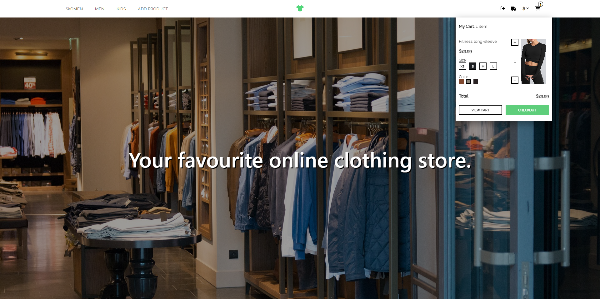
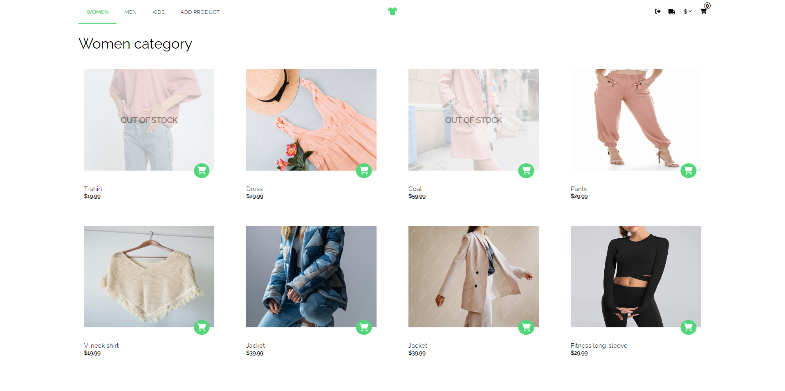
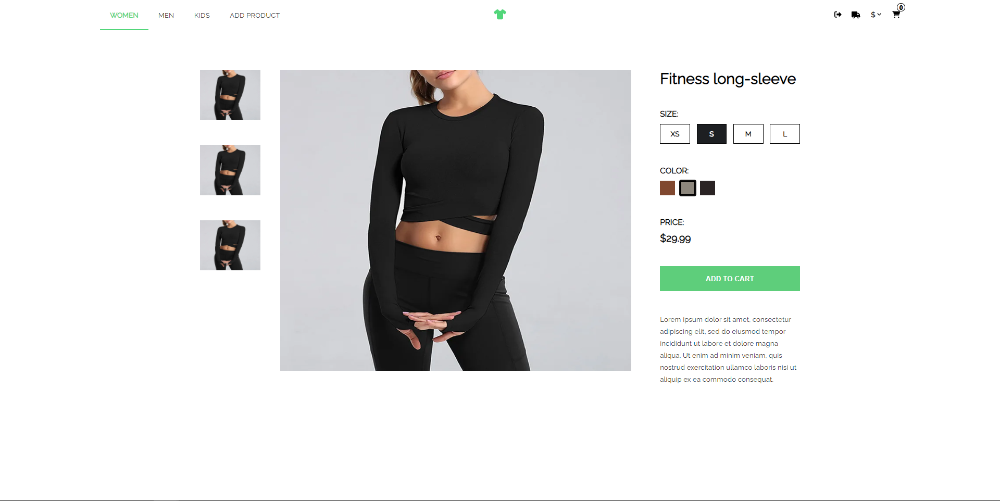
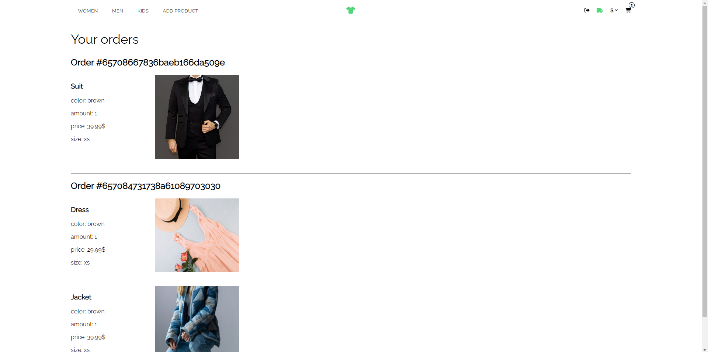

# E-commerce store

> This application is an e-commerce clothing store.
> Live demo [_here_](https://ecommerce-store-client.onrender.com/).

## Table of Contents

- [General Info](#general-information)
- [Technologies Used](#technologies-used)
- [Features](#features)
- [Screenshots](#screenshots)
- [Setup](#setup)
- [Project Status](#project-status)
- [Copyright](#copyright)

## General Information

This is one of my old projects which I rewrited using TypeScript instead of JavaScript and I generally refactored the whole project using best practices of writing code and principles like DRY and SOLID. I tried to keep most of the logic outside of the components and split them into smaller ones. I also improved the application's performance by caching fetched data with the use of React Query. I learned how to implement user authentication using JWT and how to integrate the application with Stripe for handling payments. I also wrote tests for checking cart functionality.

## Technologies Used

- React.js - version 18.2.0
- TypeScript - version 5.3.2
- Redux - version 8.1.3
- React Query - version 5.8.4
- React Router Dom - version 6.4.2
- CSS Modules

## Features

- User authentication with JWT
- User authorization based on roles
- Choosing sizes and colors of the products
- Adding products to the cart
- Currency selection
- Cart checkout integrated with Stripe
- Browsing user's orders

## Screenshots

## Setup

To get started with the project, follow the steps below:

- Clone the repository onto your device
- Open the repository in some code editor, for example VSCode and type 'npm install' in the terminal
- Add .env file with the following variables: 'REACT_APP_CLIENT_URL', 'REACT_APP_API_URL', 'REACT_APP_EXCHANGE_RATES_API_KEY' and fill them with your data
- Type 'npm start' to run the app on your localhost

## Project Status

Project is: _finished_.

## Copyright

Created by [@bystrol](https://github.com/Bystrol) - all rights reserved.
